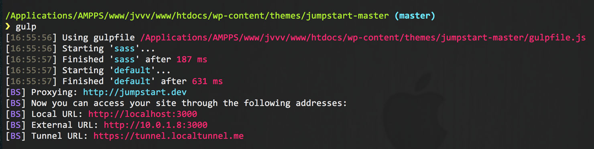
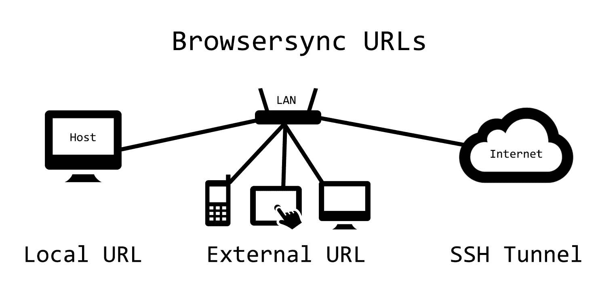

**jumpstart**
===========================

A combination of Foundation, SASS, Gulp, and Browsersync to create a modern WordPress theme with a sophisticated build process.

Most Recent: **Version 0.7.3 (June 17, 2015)** -- See [Changelog](./CHANGELOG.md)

# Folder Structure

 * `lib`           -       All of the custom functionality of the site.
    * `branding`     -       All web associated branding, e.g, favicon, login-logo, etc ...
    * `fonts`        -       Any web fonts to be loaded locally.
    * `foundation`   -       Foundation Framework.
    * `images`       -       All images to be used in the site. These images aren't related to the companies branding.
    * `inc`          -       All PHP classes and function files.
    * `js`           -       All custom js files.
    * `scss`         -       All cutom SASS files and partials.

# Install

Download `jumpstart` into your themes directory. Use it for your awesome projects.

`jumpstart` works best with Gulp. The Gulp build process is only for those who are major studmeisters:

Gulp Instructions:

1. Adjust the path of the browserSyncProxy variable in `gulpfile.js`.
2. Using the CLI, navigate to the root of your gulpfile.js file and enter `npm install`.
3. Wait for the node_modules to automatically install. Once installed, you won't have to run `npm install` for this site in the future.
4. Enter `gulp` in the CLI, without the quotes. This will start your node server, along with automattic SASS compiling.
5. That's it!

# Gulp
##### Local URL
To use Gulp, your must enter `gulp` into the Command Line Interface (CLI), thus loading the browser with the URL [http://localhost:3000](#). Any changes you make to your files in your project will automatically be refreshed on this page. In order to stop this process, simply enter `control-C` (sometimes written as `^C`) in the CLI. This will stop any Unix process. To restart this process, simply enter `gulp` in the CLI. This will load another browser window with the URL [http://localhost:3000](#).

##### External URL
While the Local URL is great for testing on your host machine, you might want to do Cross Device Testing on devices that are attached to your local WiFi. For example, you might want to see automatic SASS injection/page reloading on your tablet or phone. For these devices you will use the External URL. In the image above, the External URL is [http://10.0.1.8:3000](#). Enter the External URL that you see in your CLI into your phone or tablet. As long as they are connected to the same WiFi network as your computer, you will be synced.

##### Tunnel URL
The default setup also comes with the ability to sync devices that are not on your local WiFi network. It does this via SSH Tunneling. One use-case for this is to test your site on an [IE9 VM](http://dev.modern.ie/tools/vms/). Another use-case would be to show your currently-in-development local site to remote clients. A client in a different country could see updates to a site on your local machine while your talk to them on the phone. They will think you possess magic.

In the image above, the URL for SSH Tunneling is https://tunnel.localtunnel.me. Enter this URL in your IE9 VM, or give it to your client, and blow people's minds.

# Working with Vagrant
If you work with a team of developers, you might want to use Vagrant. In that case, check out [jVVV](https://github.com/elimc/jumpstart-vvv).

# TODO

* Improve integration with Vagrant

# Authors

**Eli McMakin**

* GitHub: https://github.com/elimc
* Web site: www.elimcmakin.com

**Matt Jensen**

* GitHub: https://github.com/Matt-Jensen
* Web site: http://matthewjensen.co/