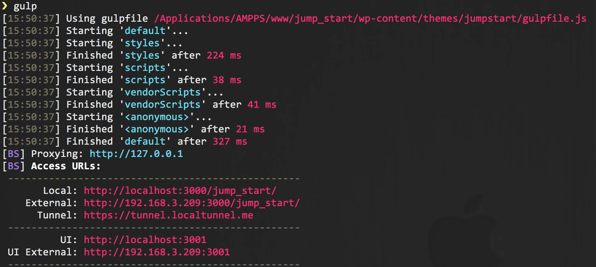

**jumpstart**
===========================

A lightweight, non-opinionated, WordPress theme with a modern build system.

Most Recent: **Version 2.1.0 (Nov 1, 2015)** – See [Changelog](./github_docs/CHANGELOG.md)

##### Why jumpstart?
There are some excellent WordPress themes out there. Unfortunately, after years of building WordPress websites, you realize that none of them appear to be moving fast enough. There should be a theme that provides everything a WordPress developer needs to rapidly start a website and deliver it to completion in the least amount of time possible.

The Ideal WordPress developer theme should:

* Not be opinionated about styling
* Use features of the latest build systems, to allow for faster coding
* Be extremely lightweight from the beginning of the project, to minimize site download time for users
* Have an excellent grid system for elegant coding
* Include helful WordPress specific functions developed over years of coding WordPress sites 

Hence, **jumpstart**

# Introducing jumpstart V2.0!

The latest version of `jumpstart` is more elegant, much smaller, and much faster to work with. There are a few major under the hood changes, including the replacement of [Zurb Foundation](http://foundation.zurb.com/) with [Lost Grid](https://github.com/corysimmons/lost), the replacement of SASS with [PostCSS](https://github.com/postcss/postcss), along with the Node and Gulp upgrades. Here are the details of the new components:

##### Lost Grid
[Lost Grid](https://github.com/corysimmons/lost) is the most advanced grid system in existence. It replaces all of the cruft in a system like Zurb Foundation or Twitter Bootstrap so that your style sheets are extremely small. That's correct, Zurb Foundation was a good framework, but it is no longer part of `jumpstart`. But, once you try Lost, you will no longer miss it. Creating a grid is incredibly easy. While jumpstart is currently missing many of the useful Foundation JS modules, new ones will be added to this theme over time.

##### PostCSS
[SASS is dead](https://www.youtube.com/watch?v=1yUFTrAxTzg). [PostCSS](https://github.com/postcss/postcss) is the future. One nice benefit of PostCSS include a major [speed increase](https://github.com/postcss/benchmark):

```
PostCSS:   61 ms
Rework:    72 ms   (1.2 times slower)
libsass:   129 ms  (2.1 times slower)
Less:      152 ms  (2.5 times slower)
Stylus:    161 ms  (2.6 times slower)
Stylecow:  171 ms  (2.8 times slower)
Ruby Sass: 1042 ms (17.0 times slower)
```

Concerned about having to learn Yet Another PreProcessor syntax? Don't be. PostCSS is capable of accepting SASSy syntax. So you can continue writing code like you always have. Additionally, there are modules you can plug in to PostCSS, like Lost Grid, that allow completely new ways of writing code. You are only limited by your own imagination.

##### Node 4.0
[Node 4.0](https://nodejs.org/en/) brings support for [ES6](https://nodejs.org/en/docs/es6/), speed improvements (due to the usage of the latest [V8 JavaScript engine](https://developers.google.com/v8/)), and a faster, more predictable, release cycle. You must have Node 4.0 or higher to run this theme with this themes Gulp task runner. To see what version of Node you have, simply navigate to your CLI and enter `node -v`. You can easily download and install the [latest version](https://nodejs.org/en/) of Node.

##### Gulp 4.0
[Gulp 4.0](https://github.com/gulpjs/gulp/blob/4.0/CHANGELOG.md) introduces speed gains from better code and the addition of parallel tasks. You must have the latest version of Gulp to run this theme with the Gulp task runner. To see what version of Gulp you have, simply navigate to your CLI and enter `gulp -v`. If you are using the [jumpstart Install Script](https://github.com/elimc/jumpstart-install-script), this will be automatically set up for you.

# Looking for a way to do install jumpstart automatically?

You may want to check out [jumpstart Install Script](https://github.com/elimc/jumpstart-install-script). The `jumpstart Install Script` is a sick [Bash](https://www.wikiwand.com/en/Bash_(Unix_shell)) script that asks you some questions and then automatically installs your whole site with BrowserSync and Gulp correctly configured. The Gulpfile included with this theme is Gulp 4.0 ready, so you don't have to do much.

# Folder Structure
```
./jumpstart
 ├── github_docs ─ Documentation for github readers.
 ├── lib ─ all of the custom functionality of the site.
 │   ├── fonts — Any web fonts to be loaded locally.
 │   ├── images — All images to be used in the site.
 │   ├── inc — All PHP classes and function files. These have been abstracted from functions.php.
 │   └── js — All js files.
 │       ├── custom — JS written by developer.
 │       ├── min — Minified JS to be loaded into theme.
 │       └── vendor — JS written by a third party.
 │   ├── scss — All cutom SASS files and partials.
 │   ├── jumpstart-init.php — Bootstrap file to load files in the inc directory.
 │   └── style.scss— Loads all Sartials
 ├── parts — Template parts inside the loop. 
```
# Install

If you are not using the [jumpstart Install Script](https://github.com/elimc/jumpstart-install-script), you will need to install the theme and set up the *gulpfile.js* manually. Download `jumpstart` into your themes directory and make sure it is your chosen theme. In the CLI you will have to enter `bower install` and `npm install`. This will install all of the dependencies for the project.

`jumpstart` works with [Gulp Task Runner](http://gulpjs.com/). The Gulp build process adds some awesome features, like automatic page reloading, file minification, and cross-broswer testing:

Gulp Instructions:

1. Adjust the path of the `browserSyncProxy` variable in *gulpfile.js*.
2. Using the CLI, navigate to the root of your gulpfile.js file and enter `npm install`.
3. Wait for the node_modules to automatically install. Once installed, you won't have to run `npm install` for this site in the future.
4. Enter `gulp` in the CLI, without the quotes. This will start your node server, along with automatic SASS compiling.
5. That's it!

# Gulp
##### Local URL
Enter `gulp` into the Command Line Interface (CLI), thus loading the browser with the URL [http://localhost:3000](#), after the script has completed installing everything. Any changes you make to your files in your project will automatically be refreshed on this page. In order to stop this process, simply enter `control-C` (sometimes written as `^C` on Macs) in the CLI. This will stop any Unix process. To restart this process, simply enter `gulp` in the CLI. This will load another browser window with the URL [http://localhost:3000](#).



##### External URL
While the Local URL is great for testing on your host machine, you might want to do Cross Device Testing on devices that are attached to your local Wi-Fi. For example, you might want to see automatic SASS injection/page reloading on your tablet or phone. For these devices you will use the External URL. In the image above, the External URL is [http://10.0.1.8:3000](#). Enter the External URL that you see in your CLI into your phone or tablet. As long as they are connected to the same Wi-Fi network as your computer, you will be synced.

Another use-case for this is to test your site on an [IE9 VM](http://dev.modern.ie/tools/vms/). Yep, your IE9 VM will automatically refresh, as well.

##### Tunnel URL
The default setup also comes with the ability to sync devices that are not on your local Wi-Fi network. It does this via SSH Tunneling. A use-case would be to show your currently-in-development local site to remote clients. A client in a different country could see updates to a site on your local machine while your talk to them on the phone. They will think you possess magic.

In the image above, the URL for SSH Tunneling is https://tunnel.localtunnel.me. Give this URL to your client, and blow their minds.


# Working with Vagrant
If you work with a team of developers, you may want to use Vagrant. I am currently researching combining Vagrant with Ansible and jumpstart.

# TODO

* Improve integration with Vagrant
* Integration of sick JS modules to replace role of Foundation JS modules in previous versions

# Authors

**Eli McMakin**

* GitHub: https://github.com/elimc
* Web site: www.elimcmakin.com

**Matt Jensen**

* GitHub: https://github.com/Matt-Jensen
* Web site: http://matthewjensen.co/